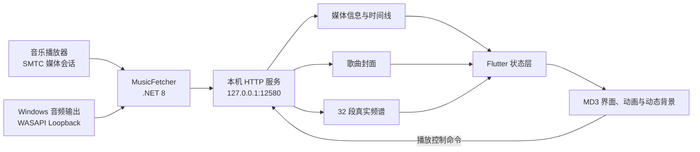

# MD3 Music Widget

<p align="center">
  
</p>

<p align="center">
  一款面向 Windows 10/11 的 Material 3 桌面音乐组件
</p>

<p align="center">
  <strong>当前版本：0.9.18</strong>
</p>

MD3 Music Widget 使用 Flutter 构建界面，通过独立的 MusicFetcher 读取 Windows 系统媒体会话和音频输出。它可以显示当前歌曲、封面、播放进度和真实音乐频谱，同时提供横版与竖版布局、动态取色、流光背景、毛玻璃和丰富的 MD3 个性化设置。

每个版本的新增功能、修复与性能变化请查看 [CHANGELOG.md](CHANGELOG.md)。

## 🎵 主要功能

### 播放信息

- 实时显示歌曲名称、歌手、封面和播放状态
- 显示歌曲播放进度，并在播放期间连续平滑更新
- 切歌时让进度条按非线性 MD3 强调曲线回到起点
- 支持上一首、播放/暂停和下一首控制
- 自动识别相同标题歌曲、歌曲重新播放以及媒体源变化

### 横版与竖版布局

- 横版和竖版可以在设置中即时切换
- 布局尺寸、元素间距和控件大小根据可用空间自动调整
- 提供小、标准、大三种固定尺寸，以及锁定宽高比的自由缩放
- 切换尺寸时先延展外层线框，150ms 后内容再以临界阻尼弹簧跟随
- 切换时使用连续的延展动画，不重新创建昂贵的背景图层
- 竖版只保留主封面，不显示横版附加封面
- 竖版设置面板会根据鼠标位置从左侧或右侧展开

### Material 3 视觉系统

- 使用 Material 3 色彩、形状、层级和运动曲线
- 从歌曲封面提取主题颜色，并自动适配浅色或深色模式
- 支持线性、胶囊和分段三种 MD3 进度条
- 上一首、播放和下一首按钮可以分别选择形状
- 支持圆形、体育场形以及多级 MD3 圆角
- 进度条和主要控件支持根据背景自动反色
- 不可用的设置项会自动隐藏，可用后再显示

### 动态背景与动画

- 保留封面取色背景、左右光效、流光和动态虚化
- 支持深色模式下的 OLED 纯黑显示
- OLED 选项仅在深色模式且关闭流光背景时出现
- 歌曲信息使用粒子溶解切换，粒子范围会根据文本尺寸调整
- 封面使用方向感知的滑动、缩放和淡入淡出动画
- 背景、设置面板和布局动画保持同一套 MD3 运动语言

### 音乐频谱

- 通过 Windows WASAPI 回环采集真实系统音频
- 提供柱状、镜像和连续平滑曲线波形三种显示方式
- 频谱面板使用毛玻璃背景，与组件主题动态融合
- 开启后始终保留面板；暂停、无歌曲或暂时没有音频数据时显示低亮度静态状态
- 不使用随机动画伪造正在播放的音乐

### 桌面使用体验

- 支持窗口置顶和鼠标穿透
- 支持系统托盘运行及完全退出
- 支持系统字体与自定义字体
- 对 Windows 缩放比例进行像素对齐，改善文字清晰度
- 启动时自动检查 MusicFetcher，并在需要时更新工作副本
- 未安装 .NET 8 时只提供微软官方在线安装方式

## 🧩 工作原理

应用由两个相互独立的部分组成：

- **Flutter 界面**：负责窗口、Material 3 布局、动画、背景、设置和绘制。
- **MusicFetcher**：使用 .NET 8 读取 Windows 系统媒体会话，通过 NAudio/WASAPI 获取音频频谱。



### 媒体信息采集

MusicFetcher 通过 Windows Global System Media Transport Controls Session Manager 获取当前媒体会话，读取：

- 标题和歌手
- 播放或暂停状态
- 当前进度和歌曲时长
- 媒体来源
- 系统提供的歌曲封面

它会为每次真实切歌生成独立的歌曲版本标识，因此即使前后两首歌的标题和歌手相同，界面仍能触发正确的封面、文字和进度动画。

### 频谱采集

MusicFetcher 使用 WASAPI Loopback 捕获当前系统输出的音频采样，对数据进行频域分析和平滑处理，然后输出固定数量的频段。Flutter 只负责插值和绘制，不会生成与音乐无关的随机波形。

### 本机通信

Flutter 与 MusicFetcher 只通过本机回环地址通信：

| 接口 | 用途 |
| --- | --- |
| `/info` | 歌曲信息、播放状态和进度时间线 |
| `/cover` | 当前歌曲封面 |
| `/spectrum.bin` | 低开销二进制实时频谱数据 |
| `/spectrum` | 兼容与诊断用 JSON 频谱数据 |
| `/command?cmd=...` | 上一首、播放/暂停和下一首命令 |

服务只监听本机地址，不对局域网或互联网开放。

## ⚡ 性能与稳定性

为了在保留特效质量的同时降低资源占用，应用采用了以下方式：

- 背景作为稳定图层保留，普通媒体轮询不会反复重建模糊层
- 封面只解码一次，背景使用同一图像的低分辨率版本
- 动态主题色结果会缓存，避免重复执行封面取色
- 频谱绘制、背景和主要动画使用独立重绘边界
- 播放时以屏幕刷新节奏更新进度，暂停或无媒体时停止无效逐帧刷新
- 媒体信息、封面和频谱请求具有独立超时和并发保护
- MusicFetcher 具备心跳检测、超时恢复和自动重连
- 频谱使用固定长度二进制包传输，关闭后停止轮询和音频采集
- 时间线会过滤无效值并限制在歌曲时长范围内
- 切歌事件会在新进度写入前保存旧画面位置，避免进度条瞬间归零
- 启动时优先复用健康的 MusicFetcher，减少等待和重复进程启动

## 🖥️ 运行要求

- Windows 10 2004（Build 19041）或更高版本
- Windows 11
- x64 系统
- [.NET 8 Runtime x64](https://dotnet.microsoft.com/download/dotnet/8.0)
- 支持 Windows 系统媒体控制（SMTC）的音乐播放器

常见的网页音乐播放器和桌面播放器通常会通过 Windows 媒体会话提供歌曲信息，但实际支持情况取决于播放器自身。

频谱依赖 Windows 音频回环采集。独占音频模式、受保护内容、部分虚拟声卡或不支持回环的设备可能无法提供真实频谱。

## 🚀 使用方法

### 安装版

运行 `MD3MusicWidget-Setup-0.9.18.exe`，按照安装向导完成安装。

### 免安装版

完整解压便携版压缩包，然后运行：

```text
music_widget_flutter.exe
```

不要只移动主程序。以下目录和文件需要保持原有相对位置：

```text
data/
images/
runtime/
MusicFetcher.exe
*.dll
```

## 🛠️ 从源码运行

需要预先安装：

- Flutter Windows 开发环境
- Visual Studio 2022 的“使用 C++ 的桌面开发”工作负载
- .NET 8 SDK
- Inno Setup 6（仅构建安装包时需要）

先构建 MusicFetcher：

```powershell
dotnet restore .\MusicFetcher\MusicFetcher.csproj
dotnet publish .\MusicFetcher\MusicFetcher.csproj -c Release -r win-x64 --self-contained false -p:PublishSingleFile=true -p:IncludeNativeLibrariesForSelfExtract=true -o .\temp\music_fetcher_publish
Copy-Item .\temp\music_fetcher_publish\MusicFetcher.exe .\MusicFetcher.exe
```

再运行 Flutter 界面：

```powershell
flutter pub get
flutter run -d windows
```

构建 Windows Release 和 Inno Setup 安装包：

```powershell
flutter build windows --release
powershell -ExecutionPolicy Bypass -File .\installer\build_installer.ps1
```

## 📁 项目结构

```text
lib/
├─ core/                 全局状态、设置和播放时间线
├─ ui/                   主窗口、轮询和窗口动画
└─ ui/widgets/           背景、设置、播放控件和频谱

MusicFetcher/            SMTC 媒体信息与 WASAPI 频谱采集
windows/                 Windows Flutter 宿主
installer/               Inno Setup 构建与签名脚本
assets/                  应用图标和界面资源
test/                    状态、布局与稳定性回归测试
```

## 🔐 隐私说明

应用不会上传歌曲信息、封面或音频数据。媒体数据只在本机 MusicFetcher 与 Flutter 界面之间传递。

在线连接仅可能发生在以下情况：

- 用户电脑缺少 .NET 8，并主动确认在线安装
- 用户使用的音乐播放器自身需要联网

## ❓ 常见问题

### 没有显示歌曲信息

确认音乐播放器已经开始播放，并且能出现在 Windows 的系统媒体控制面板中。还应确认 .NET 8 Runtime x64 已正确安装。

### 频谱没有随音乐变化

检查当前播放设备是否允许 WASAPI 回环采集。关闭播放器的独占输出模式，并确认没有使用阻止回环的虚拟声卡或受保护音频。

### 频谱在暂停后为什么仍然显示

这是预期行为。只要频谱功能处于开启状态，面板就会保留，并使用低亮度静态图形表示当前没有可用音频信号。

### Windows 显示未知发布者

开发测试版本使用自签名证书。自签名可以验证文件在签名后未被修改，但不会自动获得其他电脑信任。公开发行时应替换为受信任的正式代码签名证书。

## 📄 许可证

当前源码未附带开源许可证。在选择许可证前默认保留所有权利；如果计划允许再分发、修改或接受外部贡献，请为公开仓库补充合适的 `LICENSE` 文件。
